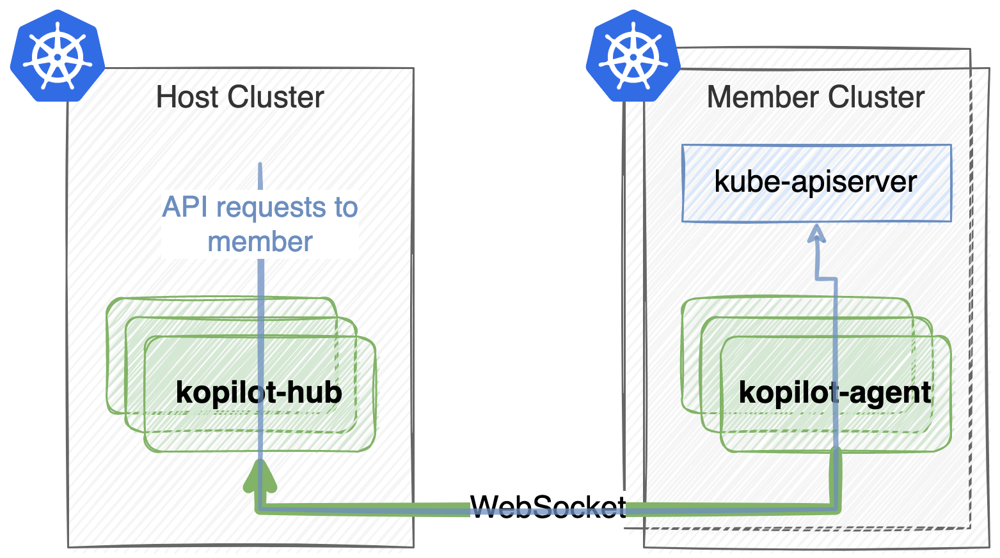

# Kopilot

[](https://github.com/smartxworks/kopilot/actions/workflows/build.yml)
[](https://codecov.io/gh/smartxworks/kopilot)
[](https://codeclimate.com/github/smartxworks/kopilot/maintainability)
[](https://goreportcard.com/report/github.com/smartxworks/kopilot)
[](http://makeapullrequest.com)

_Kopilot_ is a network tunnel used to proxy Kubernetes API requests to member clusters. _Kopilot_ leverages WebSocket as the underlying connection, secured via HTTPS.

## How Does It Work



The _kopilot-agent_ running in a member cluster will first initiate a WebSocket connection to the _kopilot-hub_ running in the host cluster. Then, the WebSocket connection will be multiplexed with [Yamux](https://github.com/hashicorp/yamux) and used as the proxy channel to the Kubernetes API of the member cluster.

## Features

- Proxies Kubernetes API requests to multiple member clusters
- Only the host cluster needs to be externally addressable
- Connections are secured and encrypted via HTTPS
- Load-balances member cluster requests when multiple hub-agent connections are available
- Access to member clusters is protected by RBAC rules on the host cluster
- Runs on x86_64 or ARM64

## Getting Started

### Prerequisites

For the host cluster:

- _Kubernetes_ 1.16+ / _minikube_ / _kind_
- _cert-manager_ 1.0+

For member clusters:

- _Kubernetes_ 1.16+ / _minikube_ / _kind_

### Installation

First, ensure that _cert-manager_ is installed on the host cluster. If it is not installed yet, you can install it as described in the _cert-manager_ [installation](https://cert-manager.io/docs/installation/kubernetes/) documentation. Alternatively, you can simply just run the single command below:

```shell
kubectl apply -f https://github.com/jetstack/cert-manager/releases/download/v1.3.1/cert-manager.yaml
```

Once _cert-manager_ is running, you can now deploy the _kopilot-hub_ on the host cluster:

```shell
kubectl apply -f https://github.com/smartxworks/kopilot/releases/download/v0.1.0/kopilot.yaml
export HUB_IP=$(kubectl get nodes -o jsonpath='{.items[0].status.addresses[0].address}')
echo $HUB_IP  # change if the value is incorrect
export HUB_PORT=$(kubectl get service kopilot-hub -n kopilot-system -o jsonpath='{.spec.ports[0].nodePort}')
kubectl create configmap kopilot-hub -n kopilot-system --from-literal=public_addr=$HUB_IP:$HUB_PORT
```

## Usage

First, create a `Cluster` object in the host cluster to represent one member cluster that needs to be proxied:

```shell
kubectl apply -f https://raw.githubusercontent.com/smartxworks/kopilot/master/samples/cluster.yaml
```

Then, deploy the _kopilot-agent_ on the member cluster:

```shell
export HUB_ADDR=$(kubectl get configmap kopilot-hub -n kopilot-system -o jsonpath='{.data.public_addr}')
export TOKEN=$(kubectl get cluster sample -o jsonpath='{.token}')
export PROVIDER=minikube  # only required if the member cluster is a minikube cluster
export MEMBER_KUBECONFIG=~/.kube/member.config  # change to your member cluster's kubeconfig path
curl -k "https://$HUB_ADDR/kopilot-agent.yaml?token=$TOKEN&provider=$PROVIDER" | kubectl apply --kubeconfig=$MEMBER_KUBECONFIG -f -
```

Once the _kopilot-agent_ is running, you can now send Kubernetes API requests to the member cluster from the host cluster with proper RBAC rules:

```shell
# create a kubectl pod with proper RBAC rules
cat <<EOF | kubectl apply -f -
apiVersion: v1
kind: ServiceAccount
metadata:
  name: kubectl
  namespace: kopilot-system
---
apiVersion: v1
kind: Pod
metadata:
  name: kubectl
  namespace: kopilot-system
spec:
  serviceAccountName: kubectl
  containers:
    - name: kubectl
      image: bitnami/kubectl
      securityContext:
        runAsUser: 0
        runAsGroup: 0
      command:
        - sleep
        - infinity
---
apiVersion: rbac.authorization.k8s.io/v1
kind: ClusterRole
metadata:
  name: kubectl
rules:
  - nonResourceURLs:
      - /proxy/*
    verbs:
      - get
---
apiVersion: rbac.authorization.k8s.io/v1
kind: ClusterRoleBinding
metadata:
  name: kubectl
roleRef:
  apiGroup: rbac.authorization.k8s.io
  kind: ClusterRole
  name: kubectl
subjects:
  - kind: ServiceAccount
    name: kubectl
    namespace: kopilot-system
EOF

# get inside the pod
kubectl exec kubectl -n kopilot-system -it -- /bin/bash

# create the member cluster's kubeconfig with service account token
export CLUSTER=default_sample
kubectl config set-cluster $CLUSTER --server=https://kopilot-hub.kopilot-system/proxy/$CLUSTER --insecure-skip-tls-verify=true
kubectl config set-context $CLUSTER --cluster=$CLUSTER
kubectl config set-credentials user --token=$(cat /var/run/secrets/kubernetes.io/serviceaccount/token)
kubectl config set-context $CLUSTER --user=user
kubectl config use-context $CLUSTER

# get pods of the member cluster
kubectl get pods -A
```

## License

This project is licensed under the Apache-2.0 License. See the [LICENSE](/LICENSE) file for more information.
